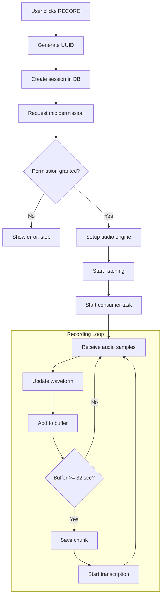
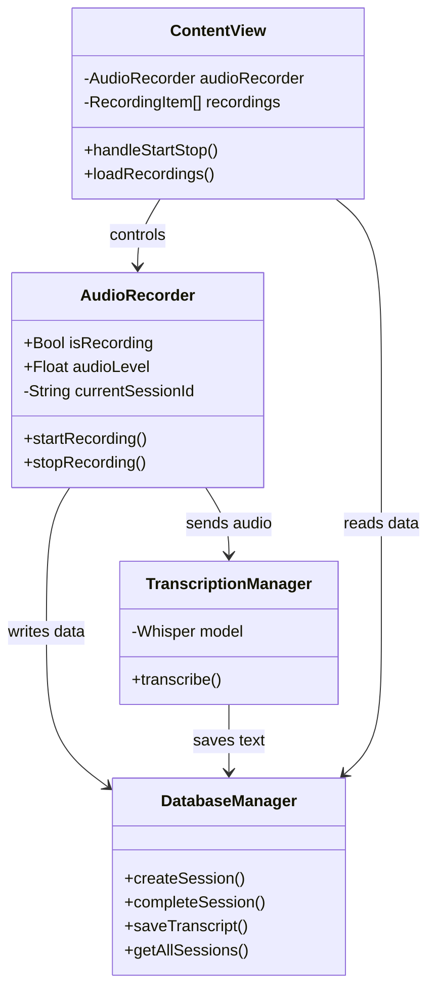
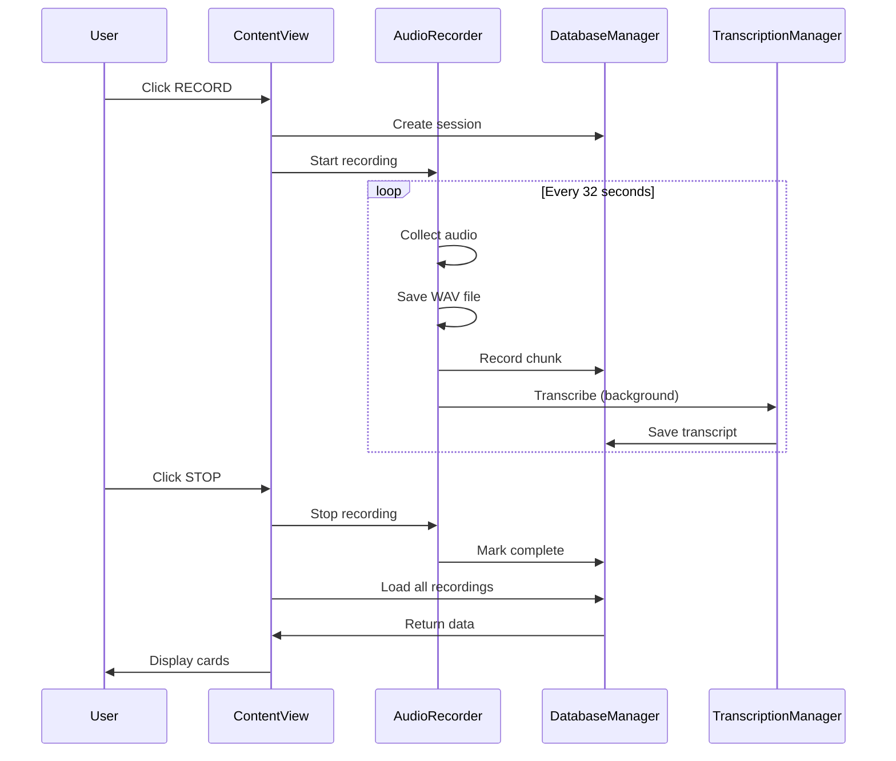

# BrainPhArt Technical Flow Documentation

**Document Version:** 1.0
**Date:** December 25, 2025
**Audience:** Technical team, Product managers, Stakeholders

---

## Executive Summary (Non-Technical)

BrainPhArt is a voice recording application that:

1. **Records your voice** when you click a button
2. **Saves audio in 32-second pieces** (called "chunks") to prevent data loss
3. **Automatically transcribes** what you said using AI (Whisper)
4. **Stores everything** in a local database on your computer
5. **Displays the text** so you can read and edit it

**Think of it like a voice memo app that automatically types out what you said.**

### The Problem We Found

When you stop recording, there's a timing issue where the last piece of audio gets saved but the system "forgets" which recording session it belongs to. This means the transcribed text appears but isn't linked to the correct recording card.

---

## How It Works (Plain English)

### When You Press RECORD:

1. The app creates a unique ID for this recording session (like a receipt number)
2. It saves this ID to the database with status "recording"
3. It asks your computer for permission to use the microphone
4. It starts listening to your voice
5. Every tiny fraction of a second, it collects sound samples
6. It shows you a moving waveform so you know it's working

### While You're Recording:

1. Sound samples pile up in a temporary storage area (buffer)
2. Every 32 seconds, the app:
   - Takes 32 seconds worth of samples
   - Saves them as a WAV audio file
   - Records the file location in the database
   - Sends the audio to the AI for transcription
   - Saves the transcribed text to the database

### When You Press STOP:

1. The app stops listening to the microphone
2. It marks the session as "complete" in the database
3. It clears the session ID from memory
4. It refreshes the screen to show your recordings

### The Bug:

The problem is step 2 and 3 happen **before** the last piece of audio finishes being transcribed. So when the AI finishes and tries to save the text, it doesn't know which session to link it to.

---

## Technical Architecture

### Components Overview

```
+------------------+     +------------------+     +------------------+
|                  |     |                  |     |                  |
|   User Interface |---->|  Audio Recorder  |---->|    Database      |
|   (ContentView)  |     |  (AudioRecorder) |     | (DatabaseManager)|
|                  |     |                  |     |                  |
+------------------+     +--------+---------+     +------------------+
                                  |
                                  v
                         +------------------+
                         |                  |
                         |  Transcription   |
                         |    (Whisper AI)  |
                         |                  |
                         +------------------+
```

---

## Classes & Data Structures

### What is a Class?

A **class** is like a blueprint for creating objects in code. Think of it like a form template - the class defines what information can be stored and what actions can be performed.

### What is a Struct?

A **struct** is similar to a class but simpler - it's just a container for related pieces of information, like a row in a spreadsheet.

---

## CLASS: ContentView

**Purpose:** The main screen of the application - everything you see.

**Type:** SwiftUI View (the visual interface)

### Properties (Data it holds):

| Property | Type | Description |
|----------|------|-------------|
| `audioRecorder` | AudioRecorder | The recording engine |
| `recordingState` | RecordingState | Either "idle" or "recording" |
| `recordings` | [RecordingItem] | List of all past recordings |
| `selectedRecording` | RecordingItem? | Which recording is currently selected (or none) |
| `editedTranscript` | String | The text shown in the editor |
| `showPreview` | Bool | Whether to show markdown preview |
| `isFloatingMode` | Bool | Whether in compact/floating mode |

### Methods (Actions it can perform):

| Method | Parameters | Returns | Description |
|--------|------------|---------|-------------|
| `handleStartStop()` | None | Nothing | Called when RECORD/STOP button pressed |
| `loadRecordings()` | None | Nothing | Fetches all recordings from database |
| `selectRecording()` | RecordingItem | Nothing | Sets which recording is selected |
| `saveTranscript()` | None | Nothing | Saves edited text to database |

---

## CLASS: AudioRecorder

**Purpose:** Handles all microphone recording and audio processing.

**Type:** ObservableObject (can update the UI when values change)

### Properties:

| Property | Type | Default | Description |
|----------|------|---------|-------------|
| `isRecording` | Bool | false | Is recording active? |
| `audioLevel` | Float | 0.0 | Current volume level (0.0 to 1.0) |
| `audioEngine` | AVAudioEngine | - | Apple's audio framework |
| `currentSessionId` | String | "" | UUID of current recording |
| `bufferQueue` | DispatchQueue | - | Thread-safe queue for audio data |
| `audioBuffer` | [Float] | [] | Raw audio samples waiting to be processed |
| `sampleRate` | Double | 0 | Samples per second (e.g., 48000) |
| `chunkNumber` | Int | 0 | Current chunk being recorded (0, 1, 2...) |
| `chunkDuration` | TimeInterval | 32.0 | Seconds per chunk |
| `consumerTask` | Task? | nil | Background task processing audio |
| `shouldContinueProcessing` | Bool | false | Flag to control the processing loop |

### Methods:

| Method | Parameters | Returns | Description |
|--------|------------|---------|-------------|
| `startRecording()` | sessionId: String | Nothing (async) | Begins recording |
| `stopRecording()` | None | Nothing | Ends recording |
| `setupAudioEngine()` | None | Nothing | Configures microphone input |
| `startConsumerTask()` | None | Nothing | Starts background chunk processing |
| `saveChunk()` | samples: [Float], isFinal: Bool | Bool (success/fail) | Saves audio to file |
| `writeWAV()` | samples: [Float], to: URL, sampleRate: Double | Nothing (throws error) | Creates WAV file |

---

## CLASS: DatabaseManager

**Purpose:** All database operations - reading and writing data.

**Type:** Singleton (only one instance exists, accessed via `DatabaseManager.shared`)

### Properties:

| Property | Type | Description |
|----------|------|-------------|
| `shared` | DatabaseManager | The single instance |
| `db` | Connection | SQLite database connection |

### Methods:

| Method | Parameters | Returns | Description |
|--------|------------|---------|-------------|
| `createSession()` | id: String | Nothing | Creates new recording session |
| `completeSession()` | id: String | Nothing | Marks session as complete |
| `createChunk()` | id, sessionId, chunkNumber, filePath, durationMs | Nothing | Records a chunk in database |
| `getAllSessions()` | None | [Recording] | Gets all sessions |
| `saveTranscript()` | sessionId, chunkNumber, transcript | Nothing | Saves transcribed text |
| `getTranscript()` | sessionId: String | String | Gets all transcripts for a session |

---

## ACTOR: TranscriptionManager

**Purpose:** Converts audio to text using Whisper AI.

**Type:** Actor (thread-safe, only one operation at a time)

**Why Actor?** Transcription is slow (5-30 seconds). Actor ensures we don't try to transcribe two things at once, which would crash.

### Properties:

| Property | Type | Description |
|----------|------|-------------|
| `shared` | TranscriptionManager | The single instance |
| `whisper` | Whisper? | The AI model (140MB in memory) |
| `isLoading` | Bool | Is model currently loading? |

### Methods:

| Method | Parameters | Returns | Description |
|--------|------------|---------|-------------|
| `loadModel()` | None | Nothing (async, throws) | Loads Whisper AI into memory |
| `transcribe()` | audioURL: URL | String (async, throws) | Converts audio file to text |
| `resampleTo16kHz()` | URL | [Float] (async, throws) | Converts audio to format Whisper needs |

---

## STRUCT: RecordingItem

**Purpose:** Represents one recording in the UI.

| Field | Type | Example | Description |
|-------|------|---------|-------------|
| `id` | String | "F7890B5C-BF0F-..." | Unique identifier |
| `createdAt` | Int | 1766686181 | Unix timestamp |
| `transcript` | String | "Hello this is..." | The transcribed text |
| `status` | String | "complete" | Either "recording" or "complete" |

**Computed Properties** (calculated on demand):
- `dateString`: "Dec 25, 18:07" - Human readable date
- `title`: First 40 characters of transcript, or "Recording Dec 25..."

---

## STRUCT: Recording

**Purpose:** Raw database record for a session.

| Field | Type | Description |
|-------|------|-------------|
| `id` | String | Unique identifier |
| `createdAt` | Int | When recording started |
| `completedAt` | Int? | When recording ended (optional) |
| `status` | String | "recording" or "complete" |
| `chunkCount` | Int | Number of chunks saved |

---

## ENUM: RecordingState

**Purpose:** Simple toggle for UI state.

| Value | Meaning |
|-------|---------|
| `.idle` | Not recording, button shows "RECORD" |
| `.recording` | Recording active, button shows "STOP" |

---

## Database Schema

### What is a Schema?

A **schema** is the structure of the database - what tables exist and what columns each table has. Think of it like defining the columns in a spreadsheet before you start entering data.

### TABLE: sessions

Stores one row per recording session.

| Column | Type | Required | Description |
|--------|------|----------|-------------|
| id | TEXT | Yes | Primary key, UUID |
| created_at | INTEGER | Yes | Unix timestamp |
| completed_at | INTEGER | No | Unix timestamp when stopped |
| status | TEXT | Yes | "recording" or "complete" |
| chunk_count | INTEGER | No | Number of chunks (default 0) |

### TABLE: chunks

Stores one row per 32-second audio file.

| Column | Type | Required | Description |
|--------|------|----------|-------------|
| id | TEXT | Yes | Primary key, UUID |
| session_id | TEXT | Yes | Links to sessions.id |
| chunk_num | INTEGER | Yes | 0, 1, 2, 3... |
| file_path | TEXT | Yes | Full path to WAV file |
| duration_ms | INTEGER | No | Duration in milliseconds |
| created_at | INTEGER | Yes | Unix timestamp |

### TABLE: chunk_transcripts

Stores the transcribed text for each chunk.

| Column | Type | Required | Description |
|--------|------|----------|-------------|
| id | TEXT | Yes | Primary key, UUID |
| session_id | TEXT | Yes | Links to sessions.id |
| chunk_number | INTEGER | Yes | Which chunk this is for |
| transcript | TEXT | Yes | The transcribed text |
| created_at | INTEGER | Yes | Unix timestamp |

---

## File Storage

### Where Files Are Saved:

```
Your Home Folder/
├── brainphart/
│   ├── audio/
│   │   └── 2025-12-25/                    <- Date folder
│   │       ├── session_ABC123_chunk_0.wav  <- First 32 seconds
│   │       ├── session_ABC123_chunk_1.wav  <- Next 32 seconds
│   │       └── session_ABC123_chunk_2.wav  <- And so on...
│   ├── models/
│   │   └── ggml-base.bin                   <- Whisper AI model (140MB)
│   └── debug.log                           <- Debug output
│
└── Library/Application Support/brainphart/
    └── database.db                         <- SQLite database
```

### WAV File Format:

Each chunk is approximately **3 MB** in size:
- 32 seconds of audio
- 48,000 samples per second
- 16-bit (2 bytes per sample)
- Mono (1 channel)
- Total: 32 × 48,000 × 2 = 3,072,000 bytes

---

## Procedural Flow: Recording

### Step-by-Step: What Happens When You Press RECORD

```
STEP 1: Button Press
━━━━━━━━━━━━━━━━━━━━━━━━━━━━━━━━━━━━━━━━━━━━━━━━━━━━━━━━━━━━━━━━━━━━━━
You click the red RECORD button.
The button triggers a function called handleStartStop().

STEP 2: Generate Session ID
━━━━━━━━━━━━━━━━━━━━━━━━━━━━━━━━━━━━━━━━━━━━━━━━━━━━━━━━━━━━━━━━━━━━━━
The app creates a unique identifier for this recording.
Example: "F7890B5C-BF0F-40AA-8238-AC463C768B9F"
This is like a receipt number - every recording gets its own.

STEP 3: Create Database Entry
━━━━━━━━━━━━━━━━━━━━━━━━━━━━━━━━━━━━━━━━━━━━━━━━━━━━━━━━━━━━━━━━━━━━━━
The app saves a new row to the "sessions" table:
- id: the UUID we just created
- created_at: current time (as Unix timestamp)
- status: "recording"
- chunk_count: 0

STEP 4: Request Microphone Permission
━━━━━━━━━━━━━━━━━━━━━━━━━━━━━━━━━━━━━━━━━━━━━━━━━━━━━━━━━━━━━━━━━━━━━━
The app asks macOS for permission to use the microphone.
If you haven't granted permission before, a popup appears.
If denied, recording stops here.

STEP 5: Setup Audio Engine
━━━━━━━━━━━━━━━━━━━━━━━━━━━━━━━━━━━━━━━━━━━━━━━━━━━━━━━━━━━━━━━━━━━━━━
The app configures Apple's AVAudioEngine to:
- Connect to your microphone
- Capture audio at 48,000 samples per second
- Send audio data to our processing code

STEP 6: Start Listening
━━━━━━━━━━━━━━━━━━━━━━━━━━━━━━━━━━━━━━━━━━━━━━━━━━━━━━━━━━━━━━━━━━━━━━
The audio engine starts. From now on:
- Every 0.085 seconds (85 milliseconds), we receive 4,096 audio samples
- Each sample is a number between -1.0 and +1.0 representing sound pressure
- We calculate the volume level and update the waveform display
- We add the samples to a buffer (temporary storage)

STEP 7: Background Processing Starts
━━━━━━━━━━━━━━━━━━━━━━━━━━━━━━━━━━━━━━━━━━━━━━━━━━━━━━━━━━━━━━━━━━━━━━
A background task starts running. It loops continuously:
1. Check: do we have 32 seconds of audio in the buffer?
2. If yes: save it as a chunk (see below)
3. Wait 100 milliseconds
4. Repeat

STEP 8: Update UI
━━━━━━━━━━━━━━━━━━━━━━━━━━━━━━━━━━━━━━━━━━━━━━━━━━━━━━━━━━━━━━━━━━━━━━
The button changes from "RECORD" to "STOP".
The waveform starts moving.
```

### Step-by-Step: Saving a Chunk (Every 32 Seconds)

```
STEP A: Extract Audio Data
━━━━━━━━━━━━━━━━━━━━━━━━━━━━━━━━━━━━━━━━━━━━━━━━━━━━━━━━━━━━━━━━━━━━━━
Take 1,536,000 samples from the buffer.
(32 seconds × 48,000 samples/second = 1,536,000)

STEP B: Create File Path
━━━━━━━━━━━━━━━━━━━━━━━━━━━━━━━━━━━━━━━━━━━━━━━━━━━━━━━━━━━━━━━━━━━━━━
Build the file name:
~/brainphart/audio/2025-12-25/session_F7890B5C..._chunk_0.wav

Create the date folder if it doesn't exist.

STEP C: Write WAV File
━━━━━━━━━━━━━━━━━━━━━━━━━━━━━━━━━━━━━━━━━━━━━━━━━━━━━━━━━━━━━━━━━━━━━━
Convert the audio samples to WAV format:
1. Write 44-byte WAV header (file format information)
2. Convert each float (-1.0 to +1.0) to 16-bit integer (-32767 to +32767)
3. Write all the audio data
4. Save to disk (~3MB file)

STEP D: Record in Database
━━━━━━━━━━━━━━━━━━━━━━━━━━━━━━━━━━━━━━━━━━━━━━━━━━━━━━━━━━━━━━━━━━━━━━
Insert a row into the "chunks" table:
- id: new UUID
- session_id: the recording's UUID
- chunk_num: 0 (or 1, 2, 3...)
- file_path: where we saved the file
- duration_ms: 32000 (32 seconds in milliseconds)

STEP E: Start Transcription (Background)
━━━━━━━━━━━━━━━━━━━━━━━━━━━━━━━━━━━━━━━━━━━━━━━━━━━━━━━━━━━━━━━━━━━━━━
Launch a separate background task to transcribe:
1. Load Whisper AI model (if not already loaded)
2. Convert audio from 48kHz to 16kHz (Whisper requirement)
3. Run AI inference (5-30 seconds)
4. Save transcribed text to "chunk_transcripts" table

This runs in the background - recording continues without waiting.

STEP F: Increment Chunk Counter
━━━━━━━━━━━━━━━━━━━━━━━━━━━━━━━━━━━━━━━━━━━━━━━━━━━━━━━━━━━━━━━━━━━━━━
chunkNumber goes from 0 to 1 (or 1 to 2, etc.)
Ready for next chunk.
```

### Step-by-Step: What Happens When You Press STOP

```
STEP 1: Button Press
━━━━━━━━━━━━━━━━━━━━━━━━━━━━━━━━━━━━━━━━━━━━━━━━━━━━━━━━━━━━━━━━━━━━━━
You click the STOP button.
handleStartStop() is called again.

STEP 2: Signal to Stop Processing
━━━━━━━━━━━━━━━━━━━━━━━━━━━━━━━━━━━━━━━━━━━━━━━━━━━━━━━━━━━━━━━━━━━━━━
Set shouldContinueProcessing = false
This tells the background loop to stop after its current iteration.

STEP 3: Stop Audio Engine
━━━━━━━━━━━━━━━━━━━━━━━━━━━━━━━━━━━━━━━━━━━━━━━━━━━━━━━━━━━━━━━━━━━━━━
Remove the audio tap (stop receiving samples).
Stop the audio engine completely.

STEP 4: Cancel Background Task
━━━━━━━━━━━━━━━━━━━━━━━━━━━━━━━━━━━━━━━━━━━━━━━━━━━━━━━━━━━━━━━━━━━━━━
Tell the consumer task to cancel.
(It may still finish its current work)

STEP 5: Mark Session Complete
━━━━━━━━━━━━━━━━━━━━━━━━━━━━━━━━━━━━━━━━━━━━━━━━━━━━━━━━━━━━━━━━━━━━━━
Update the database:
UPDATE sessions SET status='complete', completed_at=NOW WHERE id='F7890B5C...'

STEP 6: Clear Session ID ⚠️ BUG HERE
━━━━━━━━━━━━━━━━━━━━━━━━━━━━━━━━━━━━━━━━━━━━━━━━━━━━━━━━━━━━━━━━━━━━━━
Set currentSessionId = ""
The app "forgets" which session was recording.

PROBLEM: The background task might still be saving a final chunk!
When it tries to save the transcript, the session ID is empty.

STEP 7: Refresh UI
━━━━━━━━━━━━━━━━━━━━━━━━━━━━━━━━━━━━━━━━━━━━━━━━━━━━━━━━━━━━━━━━━━━━━━
Call loadRecordings() to fetch all sessions from database.
Display updated list of recording cards.
```

---

## Visual Flow Diagrams

### Recording Flow (Mermaid)



### Component Relationships (Mermaid)



### Data Flow (Mermaid)



---

## Known Bug: Session ID Race Condition

### The Problem

When you stop recording, there's a race condition:

1. **STOP pressed** - signals everything to stop
2. **Session marked complete** - database updated
3. **Session ID cleared** - `currentSessionId = ""`
4. **BUT** - background task may still be saving final chunk
5. **Transcription finishes** - tries to save with empty session ID
6. **Result** - transcript saved but not linked to any session

### Visual Explanation

```
Time ─────────────────────────────────────────────────────────────────>

     STOP          Complete        Clear ID
      │            Session            │
      ▼               ▼               ▼
══════╪═══════════════╪═══════════════╪═══════════════════════════════
      │               │               │
      │               │               │     ┌─────────────────┐
      │               │               │     │ Final chunk     │
      │               │               │     │ transcription   │
      │               │               │     │ finishes here   │
      │               │               │     │                 │
      │               │               │     │ sessionId = ""  │
      │               │               │     │ ⚠️ BUG!         │
      │               │               │     └─────────────────┘
```

### The Fix (To Be Implemented)

Capture the session ID before starting the background task, so it's preserved even after the main code clears it.

---

## Glossary

| Term | Definition |
|------|------------|
| **Actor** | A Swift type that ensures only one piece of code accesses it at a time (thread-safe) |
| **Async/Await** | Swift's way of handling operations that take time without freezing the app |
| **Buffer** | Temporary storage area where data waits to be processed |
| **Chunk** | A 32-second piece of audio, saved as a separate file |
| **Closure** | A block of code that can be passed around and executed later |
| **DispatchQueue** | A system for running code on different threads |
| **Float** | A number with decimal places (e.g., 0.5, -0.75, 1.0) |
| **Int** | A whole number (e.g., 0, 1, 42, -7) |
| **Observable** | Something the UI watches - when it changes, the screen updates |
| **Sample** | A single measurement of sound pressure at a point in time |
| **Sample Rate** | How many samples per second (48,000 = high quality) |
| **Singleton** | A class where only one instance exists (shared across the app) |
| **String** | Text data (e.g., "Hello", "F7890B5C-...") |
| **Struct** | A simple container for related data |
| **Task** | A unit of work that runs independently |
| **UUID** | Universally Unique Identifier - a random ID that won't repeat |
| **WAV** | An audio file format (uncompressed, high quality) |
| **Whisper** | OpenAI's speech-to-text AI model |

---

## Summary

BrainPhArt records audio in 32-second chunks, transcribes each chunk using local AI, and stores everything in a SQLite database. The main technical challenge is coordinating the timing between:

1. Real-time audio capture (continuous)
2. Chunk processing (every 32 seconds)
3. AI transcription (5-30 seconds per chunk)
4. User interface updates (instant)

The current bug occurs because session cleanup happens before background tasks complete. The fix involves better coordination of these concurrent operations.

---

**End of Document**
